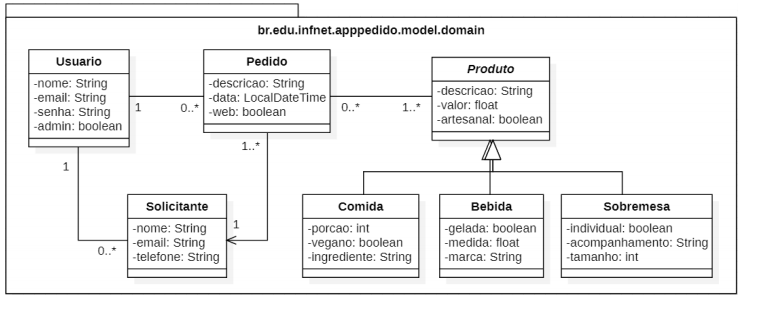
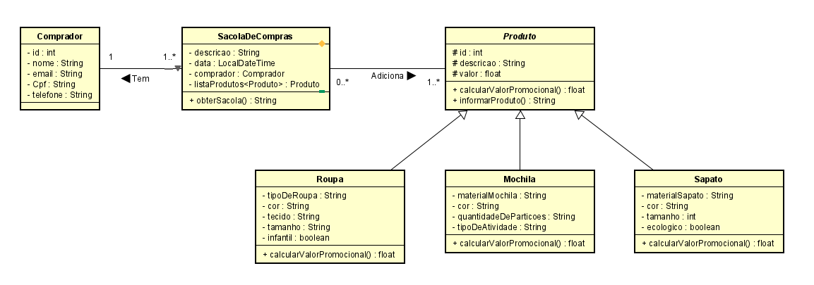

# Infnet - AT - Fundamentos de Desenvolvimento Java
Assessement da matéria de fundamentos de desenvolvimento Java

## Apresentação
Dev, você precisa construir um sistema idealizado por você que siga a modelagem abaixo:

### O diagrama

Neste diagrama temos sete classes mas apenas seis precisam ser implementadas:
Pedido, Solicitante, Produto, Bebida, Comida e Sobremesa.

Fiquem ligados que este projeto não pode ser implementado por você, mas seguir de modelo para a sua especificação. Você precisa seguir exatamente a modelagem de classes mas definindo as entidades do seu negócio.

### A demanda

Crie um projeto Spring Boot e organize em três pacotes: model.domain, model.exceptions, model.tests. No pacote model.domain: crie as seis classes; no pacote model.exceptions: crie pelo menos três classes de exceção, uma para cada classe filha; no pacote model.tests: crie três classes de teste, uma para a classe principal (Pedido, no meu caso), outra para a classe de associação (Solicitante, no meu caso) e uma para a classe mãe (Produto, no meu caso).

Cada classe do pacote model.domain precisa ter as seguintes implementações:

*Três atributos
*Sobrecarga de construtores
*Sobrescrita de toString
*Diferente tipos de atributos: String, int, float, boolean, LocalDateTime
*Pelo menos um atributo para cada tipo de dado no projeto

Siga as orientações existentes no trello no conteúdo das semanas 9 e 10. Nas classes deste diagrama, vamos trabalhar com os seguintes conceitos:

*pacotes, atributos, getters/setters, construtore
*métodos, herança, abstração, toString, StringBuilder
*sobrecarga, sobrescrita, LocalDateTime
*exception, arquivos

Recupere o projeto modelo existente no repositório do git e comece a codar!!

## Projeto Desenvolvido

Loja que vende roupas, sapatos e mochilas - appVestuarioSA

    *CLASSE PRINCIPAL: SacolaDeCompras
    *CLASSE DE ASSOCIAÇÃO: Comprador
    *CLASSE MÃE: Produto
    *CLASSES FILHAS: Mochila, Roupa, Sapato

Classes de exceções:

    *MaterialSapatoNaoPreenchidoException
    *TecidoNaoPreenchidoException
    *TipoDeAtividadeNaoPreenchidaException

